# 3. Suivi de l'Implémentation

Ce document suit l'avancement de la mise en œuvre du refactoring des modules YouTube.

**Statut Projet:** 🔴 **NON DÉMARRÉ** - En phase de préparation  
**Date de Début Planifiée:** [À définir]  
**Durée Estimée:** 5 semaines (25 jours ouvrables)  
**Budget Alloué:** €5,900  

---

## État d'avancement actuel et métriques d'achèvement

### 3.1 Vue d'Ensemble des Phases

```
Phase 0: Stabilisation       Phase 1: Architecture       Phase 2: Qualité
┌─────────────────────────┐  ┌─────────────────────────┐  ┌─────────────────────────┐
│ Sprint 1: Sécurité      │  │ Sprint 2-3: Services    │  │ Sprint 4-5: Tests       │
│ ⚪ 0% Complete          │  │ ⚪ 0% Complete          │  │ ⚪ 0% Complete          │
│                         │  │                         │  │                         │
│ 📋 5 tâches identifiées │  │ 📋 11 tâches identifiées│  │ 📋 8 tâches identifiées │
│ 🔒 0 tâches complétées  │  │ 🔒 0 tâches complétées  │  │ 🔒 0 tâches complétées  │
│ ⏱️  5 jours estimés     │  │ ⏱️  14 jours estimés    │  │ ⏱️  6 jours estimés     │
└─────────────────────────┘  └─────────────────────────┘  └─────────────────────────┘
```

### 3.2 Métriques de Baseline (État Actuel)

#### Métriques de Qualité - État Initial
| Indicateur | Valeur Actuelle | Objectif Cible | Écart | Statut |
|------------|----------------|----------------|--------|---------|
| **Complexité Cyclomatique** | 47 | ≤ 15 | -32 | 🔴 Critique |
| **Lignes par Fonction (Max)** | 89 | ≤ 50 | -39 | 🔴 Critique |
| **Couverture Tests** | 15% | ≥ 85% | +70% | 🔴 Critique |
| **Duplication Code** | 23% | ≤ 5% | -18% | 🔴 Critique |
| **Vulnérabilités Sécurité** | 3 (HIGH) | 0 | -3 | 🔴 Critique |
| **Technical Debt Ratio** | 3.2 sem-dev | < 0.5 sem-dev | -2.7 | 🔴 Critique |

#### Métriques de Performance - État Initial
| Métrique | Valeur Actuelle | Objectif | Méthode de Mesure |
|----------|----------------|----------|-------------------|
| **Temps Réponse Recherche** | 2.3s (médiane) | < 500ms | Profiling en conditions réelles |
| **Temps Chargement Stream** | 4.1s (p95) | < 1s | Monitoring APM |
| **Utilisation Mémoire** | 145MB (pic) | < 50MB | Memory profiler |
| **Blocage UI** | 2-5s par opération | 0s | User experience testing |

### 3.3 Statut par Jalon

#### 📌 Jalon 1 - Sécurisation (0% - Non démarré)
```
⚪⚪⚪⚪⚪ 0/5 tâches complétées

Tâches Identifiées:
├── 🔍 Audit sécurité complet                 [Non assignée] [0.5j]
├── 🛡️  Implémentation validation inputs      [Non assignée] [1j]
├── ✅ Tests sécurité                         [Non assignée] [0.5j]
├── 🎛️  Extraction SearchController           [Non assignée] [2j]
└── 📚 Extraction LibraryController           [Non assignée] [1j]
```

#### 📌 Jalon 2 - Architecture (0% - Non démarré)
```
⚪⚪⚪⚪⚪ 0/5 tâches complétées

Dépendances: Jalon 1 complété à 100%
```

#### 📌 Jalon 3 - Performance (0% - Non démarré)
```
⚪⚪⚪⚪⚪ 0/5 tâches complétées

Dépendances: Jalon 2 complété à 80%
```

#### 📌 Jalon 4 - Qualité (0% - Non démarré)
```
⚪⚪⚪⚪ 0/4 tâches complétées

Dépendances: Jalon 3 complété à 100%
```

#### 📌 Jalon 5 - Production (0% - Non démarré)
```
⚪⚪⚪ 0/3 tâches complétées

Dépendances: Jalon 4 complété à 100%
```

## Tâches en suspens et blocages

### 3.4 Phase de Préparation - Actions Requises

#### 🚨 Blocages Critiques (Empêchent le démarrage)

| Blocage | Description | Impact | Propriétaire | Date Limite |
|---------|-------------|---------|--------------|-------------|
| **🔴 Équipe Non Constituée** | Ressources senior/mid-level non identifiées | Projet bloqué | HR + Tech Lead | À définir |
| **🔴 Budget Non Approuvé** | €5,900 en attente de validation | Projet bloqué | Finance + CTO | À définir |
| **🔴 Environnement de Test** | Infrastructure pour tests E2E manquante | Tests impossibles | DevOps | À définir |
| **🔴 Accès yt-dlp Prod** | Permissions pour analyse sécurité | Audit bloqué | Security Team | À définir |

#### 🟡 Risques et Dépendances Externes

| Item | Type | Description | Plan d'Atténuation | Responsable |
|------|------|-------------|---------------------|------------|
| **API yt-dlp Instabilité** | Risque Externe | Changements API non documentés | Mock layer + Monitoring | Senior Dev |
| **Capacité Infra** | Dépendance | Scaling pour charge async | Capacity planning | DevOps |
| **Formation Équipe** | Dépendance | Rust async patterns | Documentation + Sessions | Tech Lead |
| **Validation UX** | Dépendance | Tests utilisateur final | Prototype + User testing | Product |

### 3.5 Backlog Technique - Tâches Non Assignées

#### Sprint 1 Préparation (5 tâches)
```yaml
1. AUDIT-001: Scan sécurité automatisé
   - Effort: 0.5 jour
   - Prérequis: Accès environnement prod
   - Outils: Cargo audit, clippy, custom rules
   
2. SEC-001: Validation robuste des inputs
   - Effort: 1 jour
   - Prérequis: Patterns d'attaque identifiés
   - Livrables: Module sanitization + tests
   
3. TEST-001: Suite tests sécurité
   - Effort: 0.5 jour
   - Prérequis: SEC-001 complété
   - Couverture: Injection, XSS, Buffer overflow
   
4. ARCH-001: Extraction SearchController
   - Effort: 2 jours
   - Prérequis: Design pattern validé
   - Impact: -500 lignes dans YouTubePane
   
5. ARCH-002: Extraction LibraryController
   - Effort: 1 jour
   - Prérequis: ARCH-001 complété
   - Impact: -300 lignes dans YouTubePane
```

#### Backlog Long-Terme (19 tâches restantes)
- **Architecture Services:** 6 tâches (8 jours effort)
- **Migration Async:** 5 tâches (6 jours effort) 
- **Tests & Performance:** 4 tâches (3 jours effort)
- **Documentation:** 2 tâches (1 jour effort)
- **Déploiement:** 2 tâches (2 jours effort)

## Prochaines étapes et actions à entreprendre

### 3.6 Actions Immédiates (Semaine Prochaine)

#### 🎯 Phase de Lancement - Sprint 0 (Préparation)

**Objectif:** Lever tous les blocages et préparer le démarrage effectif

| Action | Propriétaire | Échéance | Statut |
|--------|--------------|----------|---------|
| **👥 Constitution équipe projet** | Tech Lead + HR | J+2 | 🔴 À faire |
| **💰 Approbation budget final** | CTO + Finance | J+3 | 🔴 À faire |
| **🔧 Setup environnement dev/test** | DevOps | J+5 | 🔴 À faire |
| **📋 Kick-off meeting** | Project Manager | J+7 | 🔴 À faire |
| **📚 Préparation documentation** | Tech Writer | J+7 | 🔴 À faire |

#### 🚀 Actions de Démarrage Immédiat

**Semaine 1 - Après levée des blocages:**
```bash
# Jour 1: Setup initial
├── 🔍 Clone et analysis statique du code
├── 🛠️  Configuration IDE et outils
├── 📊 Establishment baseline metrics
└── 🤝 Team onboarding session

# Jour 2-3: Premier sprint prep
├── 🎯 Sprint planning détaillé
├── 📝 User stories création
├── 🧪 Test environment validation
└── 📋 Definition of Done finalized

# Jour 4-5: Début implémentation
├── 🔐 Audit sécurité lancé
├── 🛡️  Première sécurisation input
├── 📊 Métriques baseline captées
└── 🚦 First daily standup
```

### 3.7 Planning des 30 Prochains Jours

#### Semaine 1-2: Phase Critique
- **Focus:** Sécurité + Fondations
- **Livrables:** Vulnérabilités corrigées, Controllers extraits
- **Risques:** Découverte complexité cachée
- **Mitigation:** Buffer 20% intégré, escalation rapide

#### Semaine 3-4: Phase Architecture  
- **Focus:** Service Layer + Async migration
- **Livrables:** Architecture cible implémentée
- **Risques:** Performance dégradation temporaire
- **Mitigation:** Feature flags, monitoring renforcé

#### Semaine 5: Phase Finalisation
- **Focus:** Tests, performance, déploiement
- **Livrables:** Solution production-ready
- **Risques:** Timeline serrée pour tests complets
- **Mitigation:** Tests parallélisés, scope ajusté si nécessaire

## Assignations de ressources et dépendances

### 3.8 Équipe Cible - Profils Requis

#### 👨‍💼 Senior Rust Developer (Lead Technique)
**Statut:** 🔴 **NON IDENTIFIÉ**
```yaml
Prérequis:
  - 4+ années Rust production
  - Expérience architecture microservices
  - Connaissance patterns async/await
  - Expertise sécurité applicative

Responsabilités:
  - Design decisions techniques
  - Code reviews critiques  
  - Mentoring équipe
  - Point escalation technique

Allocation: 75% (30h/semaine sur 4 semaines)
Budget: €3,000
```

#### 👨‍💻 Mid-Level Developer (Implémentation)
**Statut:** 🔴 **NON IDENTIFIÉ**
```yaml
Prérequis:
  - 2+ années Rust
  - Expérience tests unitaires/intégration
  - Familiarité avec CLI tools
  - Bonus: expérience média/streaming

Responsabilités:
  - Implémentation core features
  - Tests automatisés
  - Documentation technique
  - Support deployment

Allocation: 50% (20h/semaine sur 4 semaines)  
Budget: €1,600
```

#### 👩‍💻 Junior Developer (Support)
**Statut:** 🔴 **NON IDENTIFIÉ**
```yaml
Prérequis:
  - Bases Rust solides
  - Expérience testing frameworks
  - Rigueur documentation
  - Volonté apprentissage

Responsabilités:
  - Tests end-to-end
  - Documentation utilisateur
  - Monitoring setup
  - Bug fixes mineurs

Allocation: 25% (10h/semaine sur 2 semaines)
Budget: €300
```

### 3.9 Matrice de Responsabilités (RACI)

| Tâche / Rôle | Senior Dev | Mid Dev | Junior Dev | Tech Lead | DevOps | Product |
|--------------|------------|---------|------------|-----------|--------|---------|
| **Architecture Design** | R | C | I | A | I | I |
| **Security Implementation** | R | C | I | A | C | I |
| **Service Layer Code** | A | R | I | C | I | I |  
| **Async Migration** | A | R | C | C | I | I |
| **Unit Testing** | C | R | R | A | I | I |
| **E2E Testing** | C | C | R | A | C | I |
| **Performance Optimization** | R | C | I | A | C | I |
| **Deployment** | C | C | C | A | R | I |
| **User Acceptance** | I | I | I | C | I | R |

**Légende RACI:**
- **R** = Responsible (Exécute)
- **A** = Accountable (Approuve) 
- **C** = Consulted (Consulté)
- **I** = Informed (Informé)

### 3.10 Dépendances Critiques et Timeline

#### 🔗 Chaîne de Dépendances Bloquantes

```mermaid
gantt
    title Dépendances Critiques Refactoring YouTube
    dateFormat  X
    axisFormat %d

    section Préparation
    Équipe Constituée           :crit, team, 0, 2
    Budget Approuvé            :crit, budget, 0, 3  
    Env Test Ready             :crit, env, 1, 4
    
    section Sprint 1
    Audit Sécurité            :audit, after team, 1
    Input Validation          :valid, after audit, 2
    Controllers Extract       :controllers, after valid, 3
    
    section Sprint 2-3  
    Service Layer             :services, after controllers, 4
    Async Migration           :async, after services, 3
    
    section Sprint 4-5
    Testing Complete          :testing, after async, 2
    Production Deploy         :deploy, after testing, 1
```



#### ⚠️ Points de Synchronisation Critiques

| Milestone | Dépendances Internes | Dépendances Externes | Date Cible |
|-----------|---------------------|---------------------|-------------|
| **Kick-off Ready** | Équipe + Budget + Env | Approbations management | J+7 |
| **Security Baseline** | Audit tools + Access | Security team review | J+12 |  
| **Architecture Review** | Service design | Infrastructure capacity | J+19 |
| **Performance Validation** | Async implementation | Load test environment | J+26 |
| **Production Deployment** | All tests passing | Deployment window | J+30 |

---

**📊 Dernière Mise à Jour:** [Date actuelle]  
**🔄 Fréquence de Révision:** Quotidienne (phase active), Hebdomadaire (préparation)  
**📞 Contact Escalation:** [tech-lead@company.com] - [project-manager@company.com]  
**📈 Dashboard Temps Réel:** [Lien vers monitoring project]

---

### Notes de Statut
- **🔴 CRITIQUE:** Action bloquante requise immédiatement
- **🟡 ATTENTION:** Risque identifié, monitoring requis  
- **🟢 OK:** Progression normale
- **⚪ NON DÉMARRÉ:** En attente de prérequis
- **✅ TERMINÉ:** Validation complète effectuée